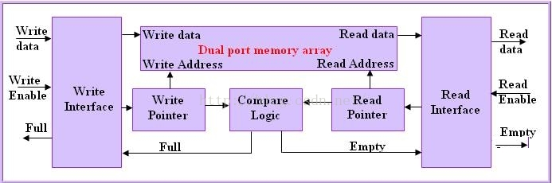
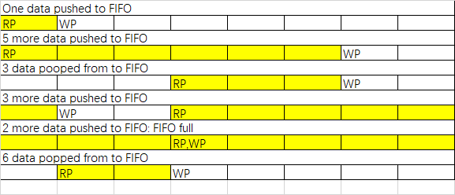
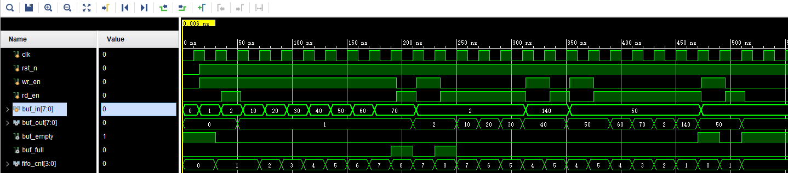

# Introduction
FIFO uses a dual port memory and there will be two pointers to point read and write addresses. Here is a generalized block diagram of FIFO. \
\
Generally fifos are implemented using rotating pointers. We can call write and read pointers of a FIFO as head and tail of data area. Initially read and write pointers of the FIFO will point to the same location. Here is an example to explain how FIFO uses the memory. This is a fifo of length 8, WP and RP are the locations where write pointer and read pointer points. Shaded area in the diagram is filled with data.

\
When ever FIFO counter becomes zero or BUF_LENGTH, empty or full flags will be set. fifo_counter is incremented if write takes place and buffer is not full and will be decremented id read takesplace and buffer is not empty. If both read and write takes place, counter will remain the same. rd_ptr and wr_ptr are read and write pointers. Since we selected the bits in these registers same as address width of buffer, when buffer overflows, values will overflow and become 0.
# Question
Please first answer the following question before you get down to writing the code.
There is a 8-bit FIFO whose input clock is 100MHz while output clock is 95MHz, suppose that each time the FIFO will receive a package with 4K bits and the interval for each package is long enough, please give the minimum FIFO depth.

# Declaration of the top-level
In this lab, you do not have to test the code on board, write a testbench and generate the right waveform. Please use the entity declaration as below：
```
module fifo(
	input clk,rst_n,
	input wr_en,rd_en,            //write enable signal and read enable signal
	input [7:0] buf_in,           // data input to be pushed to buffer
	output reg [7:0] buf_out,     // port to output the data using pop
	output empty, full,           // buffer empty and full indication 
	output reg [3:0] fifo_cnt  // number of data pushed in to buffer  
);
```

As shown above, at 30ns, buf_in is 1, the fifo get the data and the fifo_cnt becomes 1. At 50ns, the read signal is enabled then you can get 1 at the output port. At 190ns, there are totally 9 data wrote into the fifo and 1 data read from the fifo, so there are 8 data in the fifo and the full signal becomes 1. When the fifo is full, you cannot push any extra data to it. At 200ns, the write signal is set to 0 and the read signal is set to 1, 1 data is read from the fifo and then the full signal comes back to 0. Since the testbench is given to you, you should try to generate the same waveform as the above one. The testbench is given in [<src/fifo_tb.v>](<src/fifo_tb.v>)

# Submit
+ You should submit:
1. Code for the fifo
2. The secreenshot of the simulation
3. The answer for the question
The answer and the secreenshot should be packaged into a pdf file.
+ File Organization Schema in Package:\
EE216_HW1_[Name][ID].zip\
├─ fifo.v\
└─ fifo.pdf
