# Vivado Tutorial
You can download Vivado from https://www.xilinx.com/support/download.html, we recommend you to download SDSoC 2019.1 since it will be used in later session.
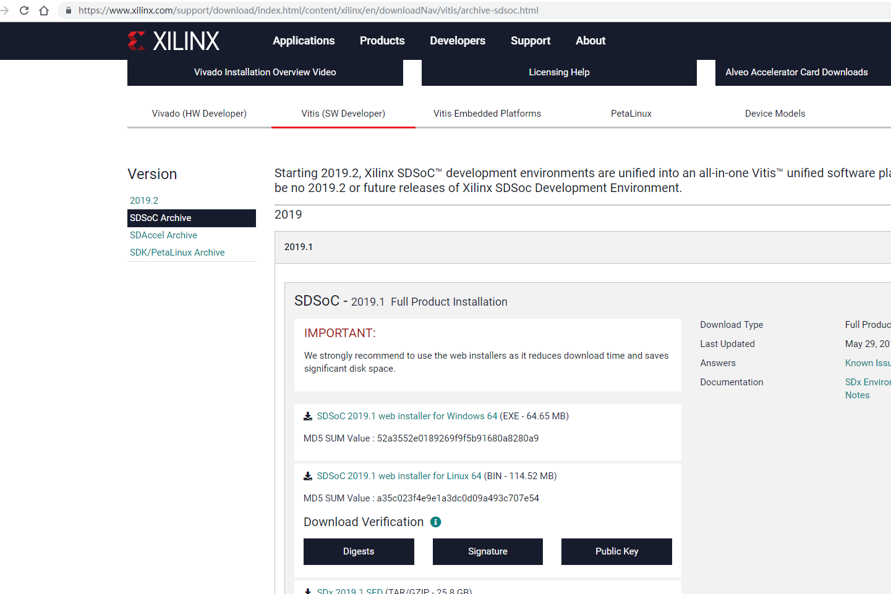

## Introduction
In our lab, we will guide you to create a simple digital design using Xilinx Vivado software. A typical digital design flow consists of creating new projects, adding source design file, analyzing behavioral simulation, RTL analysis, synthesis, adding constraints, implementation, timing simulation，generating bitstream and configuring FPGA. You will go through the typical design flow targeting the Zynq-7000 All
Programmable SoC based ZedBoard. The typical design flow is shown below. We focus on the first three steps in this tutorial.


## General Flow
### Create A New Project
1. Open Vivado by selecting Start > All Programs > Xilinx Design Tools > Vivado 2019.2 >Vivado 2019.2
2. Click Create New Project to start the wizard. You will see Create A New Vivado Project dialog box. Click Next.

  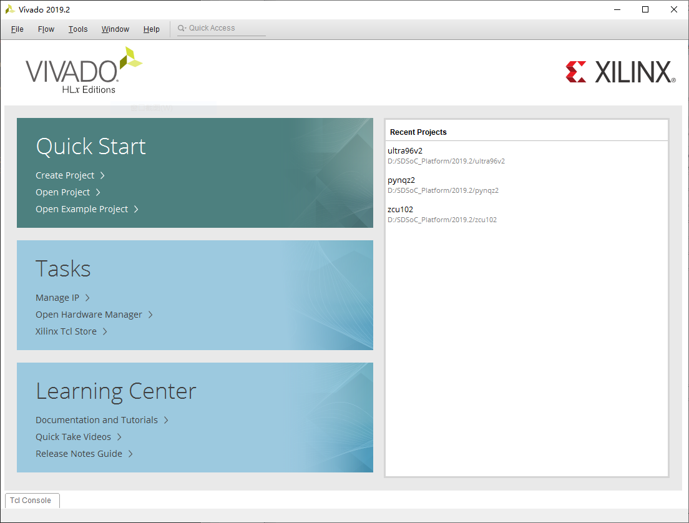

3. Enter D:/2020/EE216/Lab in Project location field.
4. Enter tutorial in the Project name field. Make sure that the Create Project Subdirectory box is checked. Click Next.

  

5. Select RTL Project option and check the Do not specify sources at this time box in the Project Type form, and click Next.

  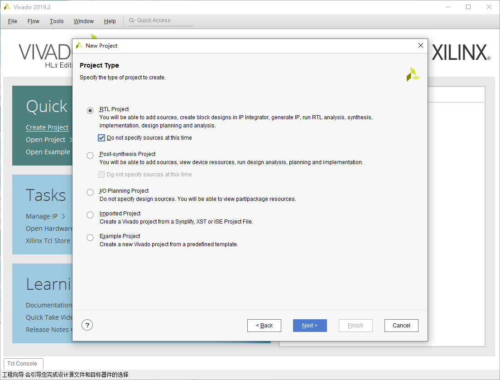

6. Enter tutorial in the Project name field. Make sure that the Create Project Subdirectory box is checked. Click Next.

  

7. You will see New Project Summary dialog box. Click Finish.

  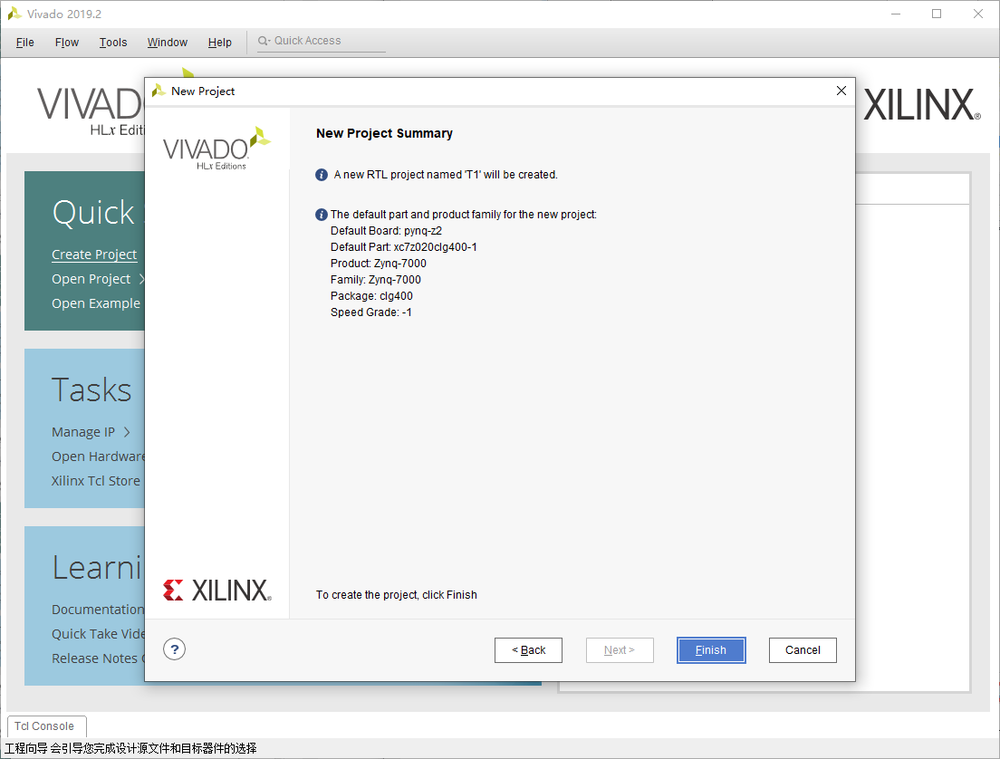
  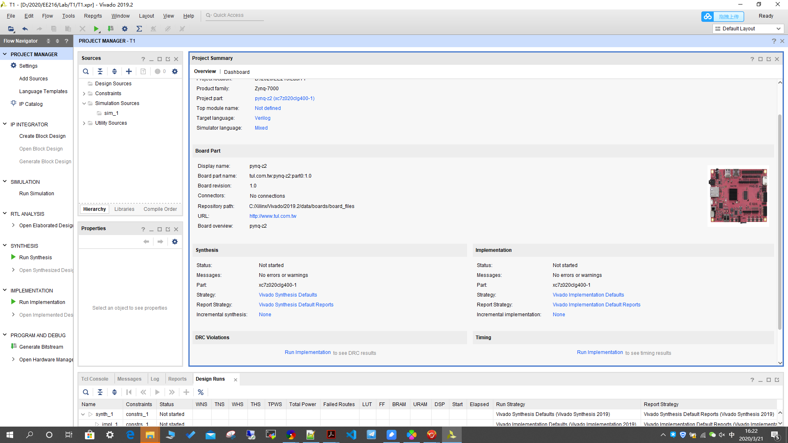

### Add Source Design File

1. Click Add Sources under the Project Manager tasks of the Flow Navigator pane.

  

2. Select the Add or Create Design Sources option and click Next.

  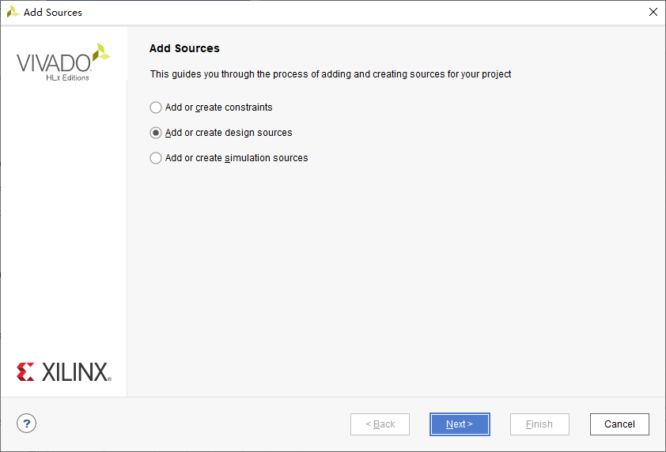

3. In the Add Sources Files form, click the Create Files button.

  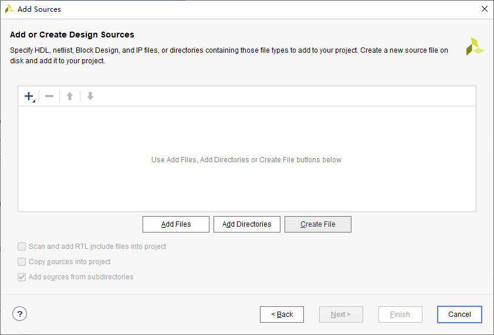

4. Set the File type to Verilog and input the File name such as top, and click OK.
  
  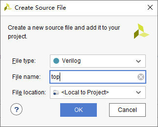

5. Click Finish.

  

6. In I/O Port Definition of the pop-up Define Module, enter the design module required port, and set the port, if the port is bus type, check the Bus option, and set the MSB and LSB based on the bus width. Click OK when finished.

  

7. Double click the new created source file top and open it.

  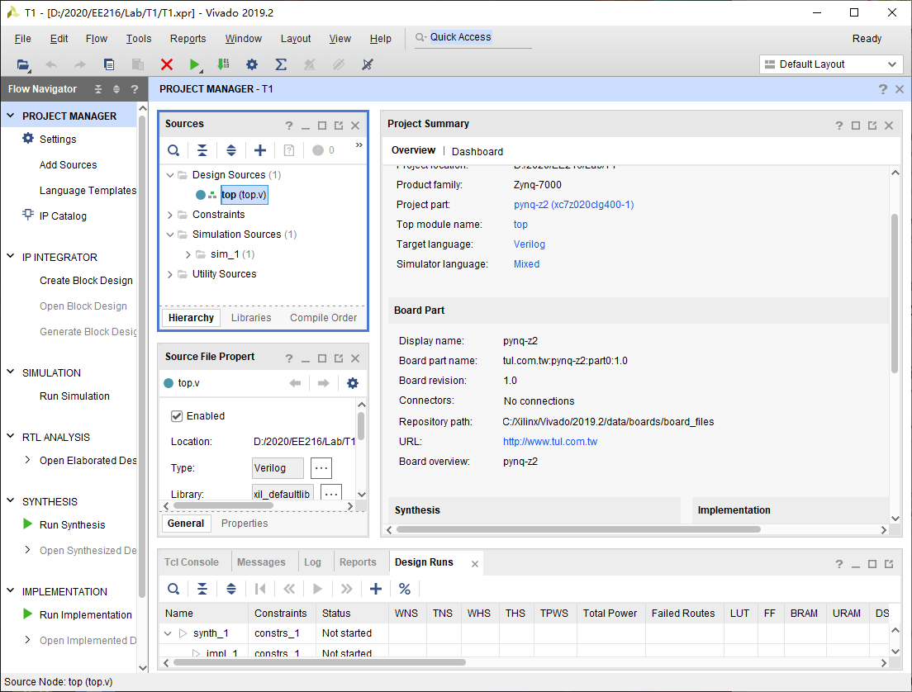

8. Now you can type in your own Verilog design code.
  
  

9. Save the file

```

module top(
    input a,
    input b,
    output [5:0] x
    );
assign x[0] = a | b;
assign x[1] = a |(~b);
assign x[2] = a ^ b;
assign x[3] = a ^(~b);
assign x[4] = a & b;
assign x[5] = a &(~b);
endmodule

```

### Behavioral Simulation
1. Click Add Sources under the Project Manager tasks of the Flow Navigator pane.
  
  

2. Select the Add or Create Simulation Sources option and click Next.
  
  

3. In the Add Sources Files form, click the Create File button.
  
  

4. Set the File type to Verilog and input the File name, and click OK.
  
  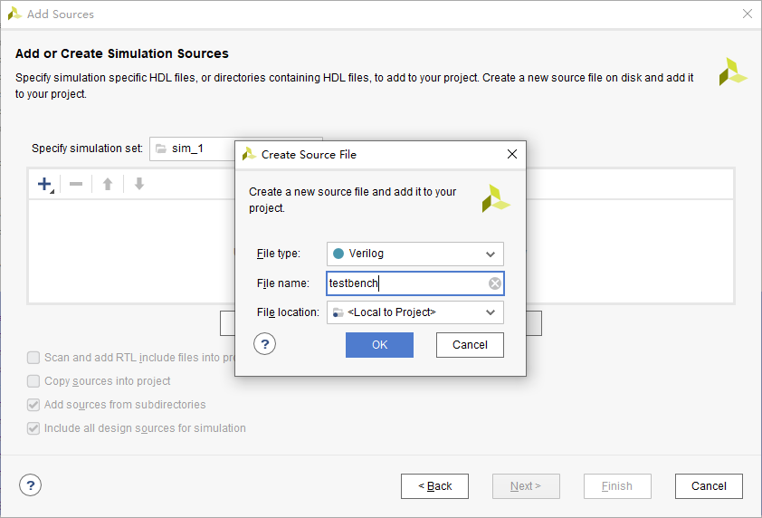

5. Click Finish.
  
  

6. Click OK.
  
  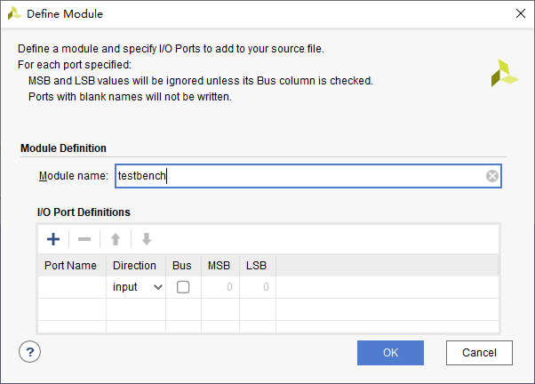

7. Click Yes.
  
  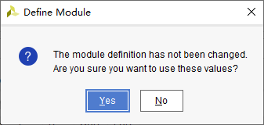

8. Double click the new created source file testbench and open it. Then you can type in the test code.
  
  

9. Save the file.
  
```verilog
module testbench();
reg a;
reg b;
wire [5:0] x;
top uut_top(
.a(a),
.b(b),
.x(x));
initial
begin
a = 0;
b = 0;
#10;
a = 0;
b = 1;
#10;
a = 1;
b = 0;
#10;
a = 1;
b = 1;
#10;
end
endmodule
```

10. Select Simulation Settings under the Project Manager tasks of the Flow Navigator pane. A Project Settings form will appear showing the Simulation properties form.
  
  

11. Select the Simulation tab, and set the Simulation Run Time value to 1000 ns and click OK.
  
  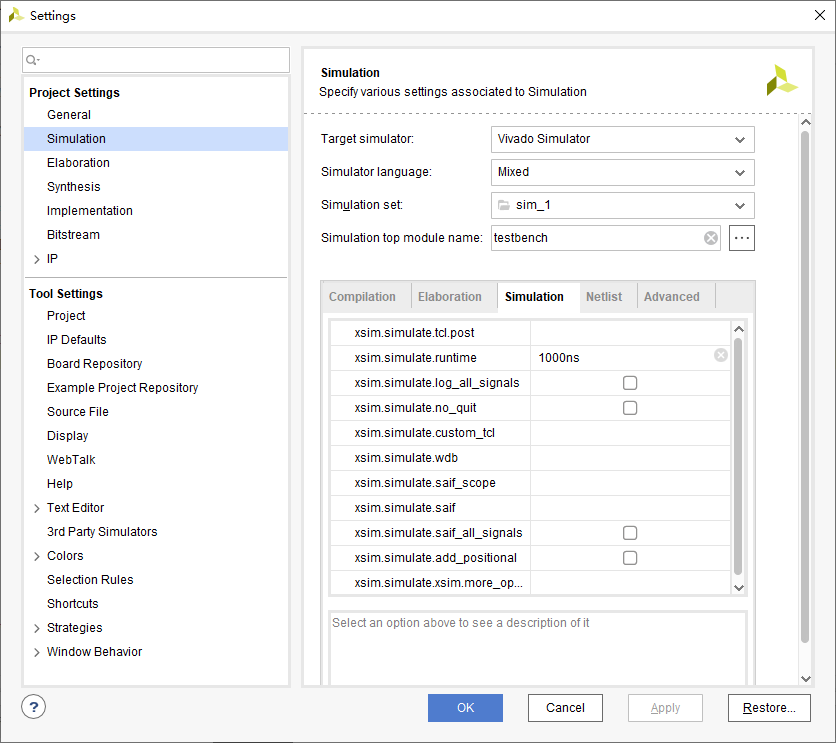

12. Click on Run Simulation > Run Behavioral Simulation under the Project Manager tasks of the Flow Navigator pane.

  

13. The testbench and source files will be compiled and the Vivado simulator will run (assuming no errors). You will see a simulator output similar to the one shown below.

  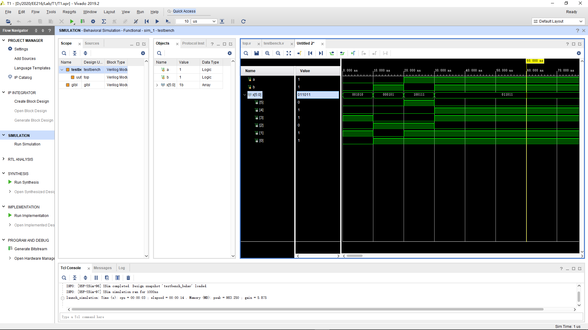